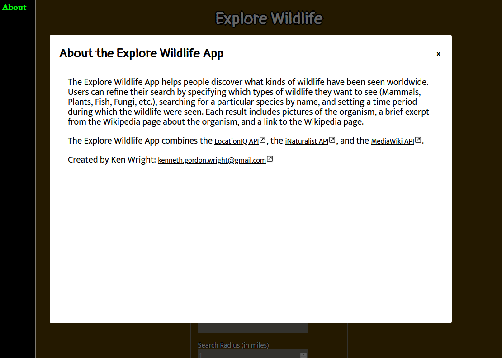
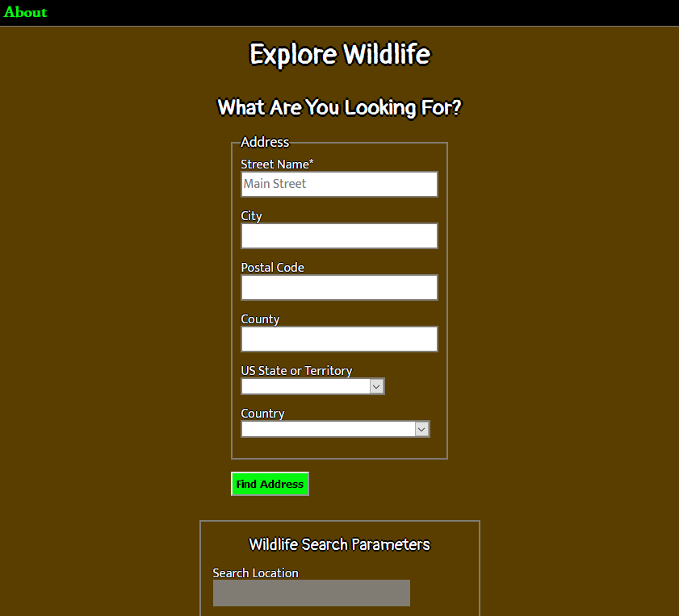
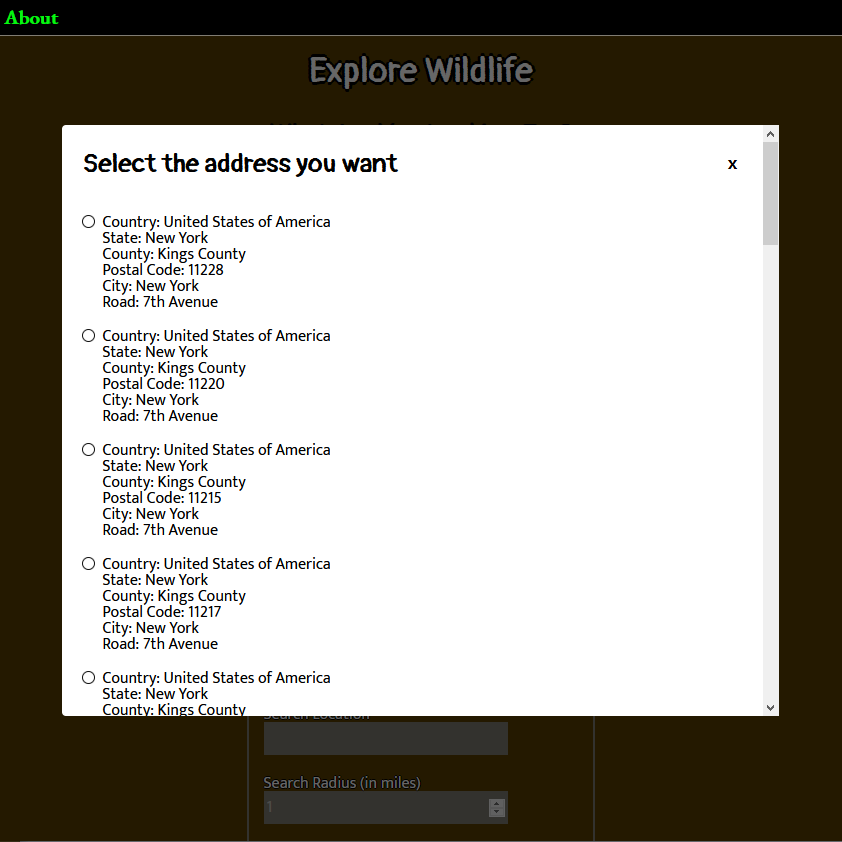
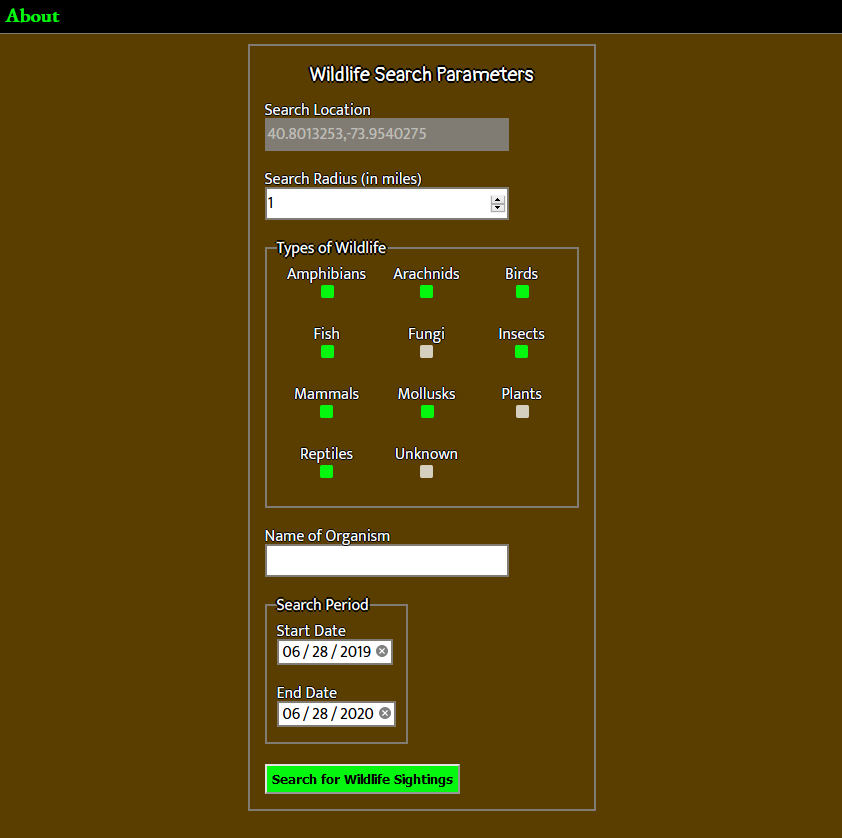
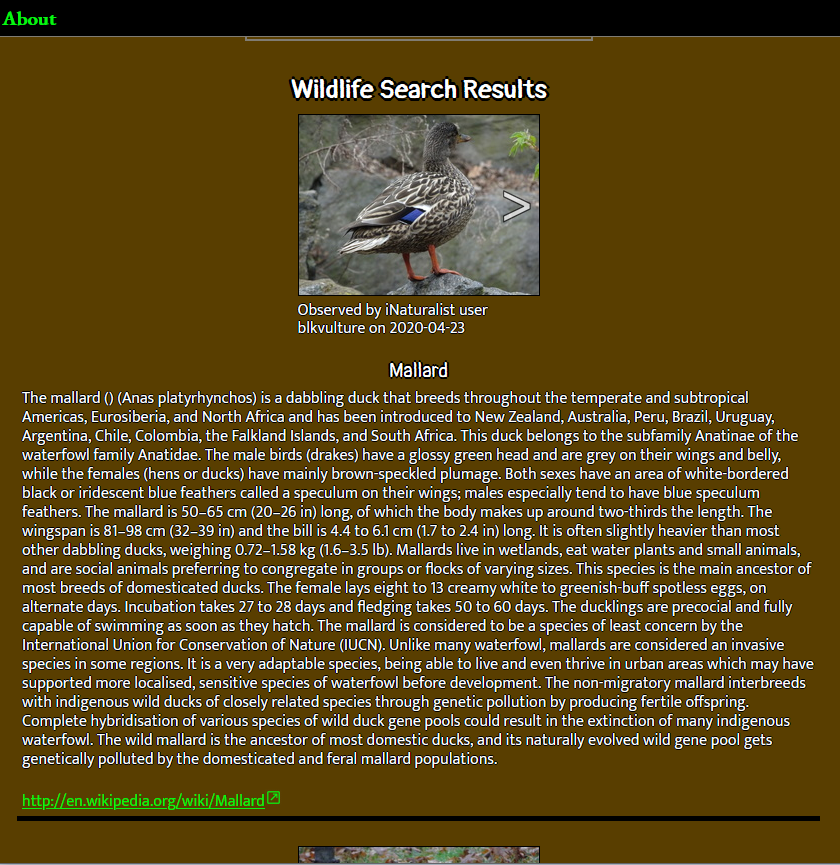

# Explore Wildlife

An application that lets people search for wildlife that have been seen in locations anywhere in the world.

## Screenshots
About:

Search Location Parameters: Address

Search Location Results: Address

Wildlife Search Parameters:

Wildlife Search Results:

## Technologies Used
* HTML
* CSS
* JavaScript
* jQuery

## Features
* Specify a location to search for wildlife
* Filter which kinds of wildlife to search for (e.g. mammals, reptiles, plants)
* Specify during which dates the wildlife were seen
* Filter the results by an organism name

## Live Version

- [Live Version](https://kindredprime.github.io/explore-wildlife/)
